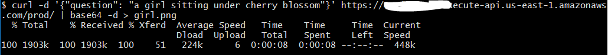

# An example of Text-to-Image generation using Stability.ai Diffusion 1.0 Model in AWS Bedrock.
This example demonstrates how AWS Bedrock can be used for Text-to-Image generation and exposed as an API.  

This project is developed using AWS CDK in TypeScript.

## What does it build?
* Creates an AWS Lambda function that interacts with AWS Bedrock
* Uses Stability.ai Diffusion 1.0 Model model for generating image
* Creates an AWS API Gateway endpoint to expose the API

## Steps to run and test
* Deploy the CDK code. Wait for the deploy to finish.  It will print out the API endpoint for you to use. Use the following example to save the generated image to a file.
  * 
* Here is the image that was generated for me based on the prompt.
  * 

## References
* Learn about [AWS Bedrock](https://aws.amazon.com/bedrock/)
* AWS Bedrock [Foundation Models](https://docs.aws.amazon.com/bedrock/latest/userguide/models-supported.html)